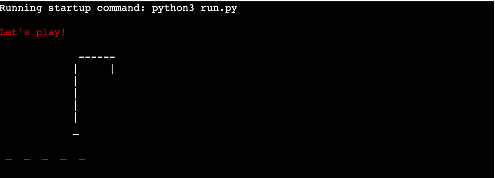
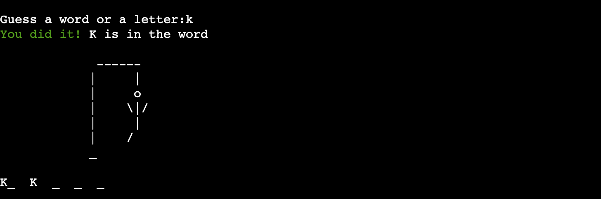
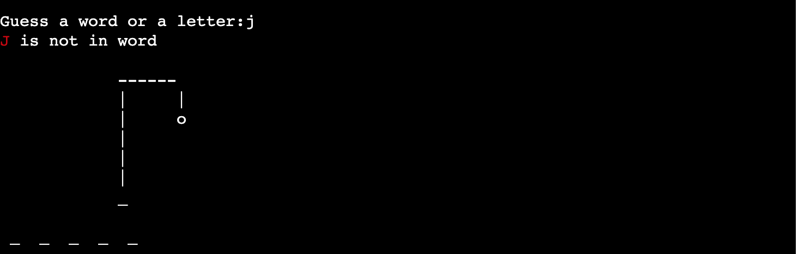
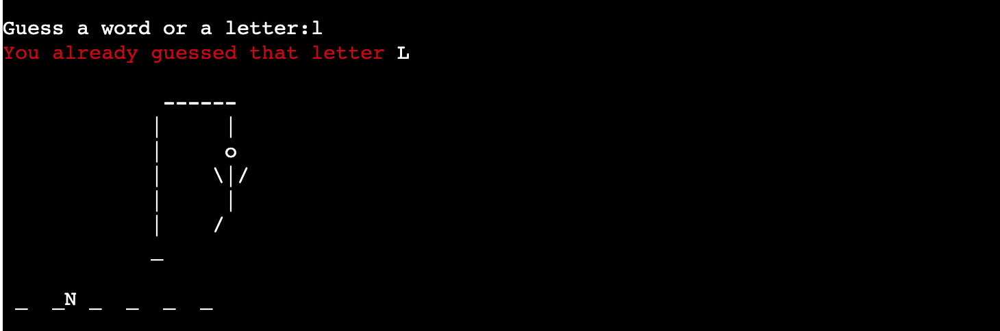

# Hangman Game 
Welcome to the Hangman Game in Python! This project is a simple command-line implementation of the classic word-guessing game, Hangman. The objective of the game is to guess the hidden word by suggesting letters within a limited number of attempts.

## Features

### Random word selection from a predefined list.

- The game selects a random word from a predefined list.

### Interactive command-line interface.

- The player has a limited number of attempts to guess the word.

### Display of word progress

- Each correct guess shows up on the word line, slowely building the word.

### Display of incorect guesses

- Each incorrect guess decreases the number of remaining attempts and makes the hangman art more complete. 

 ### Used letters

-The player wins if they correctly guess all the letters in the word before running out of attempts.
- The player loses if they run out of attempts before guessing the word.

### Art representation of the hangman state.

- The art representation  make it easy for the user to see what’s their progress in the game is. 

### Features Left to Implement
- I would implement three different levels of difficulty.

###  Different level of Testing
I have tested the code by the following methods:
-	PEP8 Validation: The code has passed the PEP8 validator with no issues found.
-	Manual Testing: I manually tested the code by passing various invalid inputs such as multiple letters, numbers, spaces, and special characters.
-	Win/Lose Scenarios: I tried all possible ways to either win or lose the game, ensuring that no bugs were found during these tests.
-	Terminal Testing: The game was tested on both the Heroku terminal and the local terminal.

### Validator Testing
-	No errors were returned when passing through the official PEP8 validator.

### Bugs
- No bugs found
...
### Reaming Bugs
-	No bugs reaming
Deployment

### Deployment
This project was deployed at Heroku, steps for deploy are listed bellow:
-	Fork or clone the repository.
-	Creat a new Heroku app.
-	Set up the configs for the deployment.
-	Link the Heroku app to the repository, then Deploy.
-	The live link can be found here: (https://project3-hangman-9e8f8cca5ebe.herokuapp.com/)

### Credits:

I searched for solutions of the problems that occurred during the project development on the following websites:

- w3schools.com
- my mentor
- code insitute tutors
-	Geeksforgeeks
-	Freecodecamp
-	The Code Institute for the deployment terminal.

